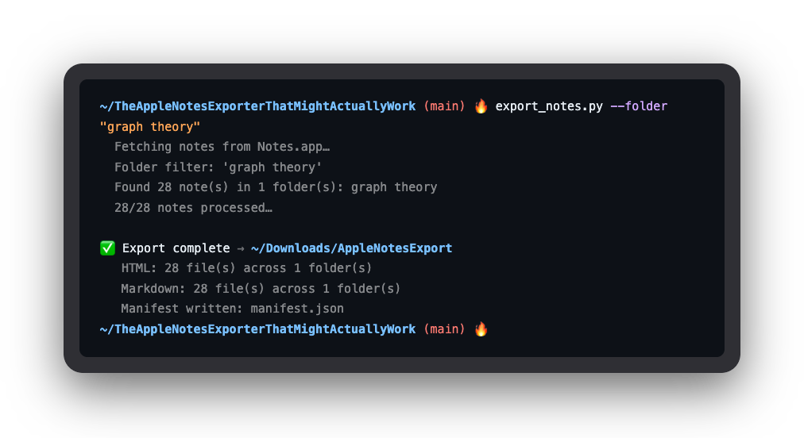

# The Apple Notes Exporter That Might Actually Work

<figure align="center" style="margin: 32px 0;">
    
</figure>

## Foreword

**Script:** `export_notes.py`

## Rejected

- <https://github.com/threeplanetssoftware/apple_cloud_notes_parser>
- <https://github.com/kzaremski/apple-notes-exporter>

## Download

```sh
git clone https://github.com/eucalyptus-viminalis/TheAppleNotesExporterThatMightActuallyWork
cd TheAppleNotesExporterThatMightActuallyWork
pip install markdownify  # optional, for Markdown export
```

## Commands

```sh
# optional but recommended
pip install markdownify

# usage
python export_notes.py --help

# export everything (HTML + Markdown) to ~/Downloads/AppleNotesExport
python export_notes.py

# export one folder, Markdown only
python export_notes.py --folder "Work" --format md

# preview without writing files
python export_notes.py --dry-run

# Obsidian-friendly output
python export_notes.py --format md --obsidian-images --no-frontmatter
```

On first run, macOS will prompt Terminal to control Notes.app — click OK.

## Property

**Accuracy**
- Faithful HTML-to-Markdown conversion
- Handles Apple Notes HTML quirks (fragmented tags, NBSP, broken nested lists)

**Simplicity**
- Single file, nothing to install or configure
- stdlib only; `markdownify` is an optional dependency for Markdown export
- Requires Notes.app automation permission (macOS prompts on first run)

**Limitations**
- macOS only — uses AppleScript via Notes.app
- Slow on large libraries; AppleScript traversal has no bulk API

## Features

**Export**
- Exports HTML and Markdown, or either alone (`--format`)
- Custom output directory (`--out`)
- Filter to a single folder (`--folder`)
- Dry run: preview notes without writing files (`--dry-run`)

**Markdown**
- YAML front matter with title, folder, created, modified dates
- `--no-frontmatter` and `--no-title` flags for clean output
- 4-space list indent for Obsidian compatibility

**Images**
- Extract base64-encoded images to `_attachments/` (`--extract-images`)
- Obsidian `![[]]` link syntax (`--obsidian-images`)

## Last Good

| component | version | date       |
| --------- | ------- | ---------- |
| Notes     | 4.13    | 2026-03-31 |
| macOS     | v26.3   | 2026-03-31 |

## TODO

- [ ] tests for typical notes and edge cases
- [ ] try exporting notes with code blocks, and other funky elements
